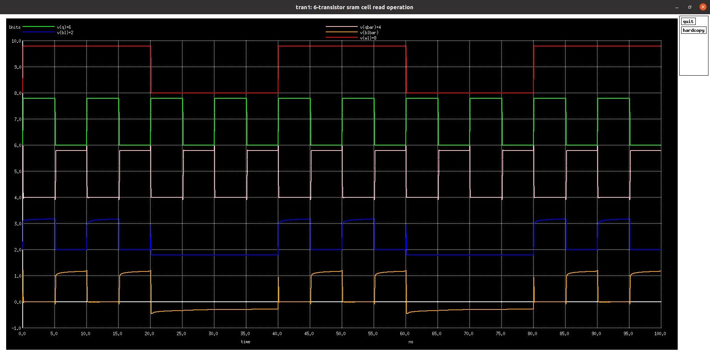
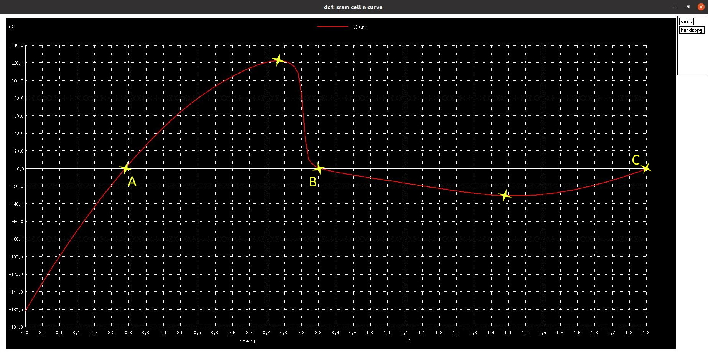

# Design of 1024x32 SRAM (32Kbits) using OpenRAM and SKY130 PDKs 
  This repository aims at design of 1024x32 SRAM cell array (32Kbits or 4KB) with a configuration of 1.8 V operating voltage and access time less than 2.5ns using Google SkyWater SKY130 PDKs and OpenRAM memory complier.
  
# Table of Contents
  - [Introduction To SRAM Cell Design](#introduction-to-sram-cell-design)
  - [Setting Up Environment](#setting-up-environment)
      - [Open-Source Tools Used](#open-source-tools-used)
      - [Cloning and Installing](#cloning-and-installing)
      - [Independent Installation](#independent-installation)
  - [SRAM Memory Architecture](#sram-memory-architecture)
  - [Custom Cells for OpenRAM](#custom-cells-for-openram)
      - [About OpenRAM](#about-openram)
      - [Custom Cells](#custom-cells)
  - [Pre-Layout Schematic and Simulations](#pre-layout-schematic-and-simulations)
      1. [6T SRAM Cell](#1-6t-sram-cell)
      2. [Pre-charge Circuit](#2-pre-charge-circuit)
      3. [Sense Amplifier](#3-sense-amplifier)
      4. [Write Driver](#4-write-driver)
      5. [Tri-State Buffer](#5-tri-state-buffer)      
      6. [D-Flip-Flop](#6-d-flip-flop)      
      - [1-bit SRAM](#1-bit-sram)
  - [Future Work](#future-work)
  - [References](#references)
  - [Acknowledgement](#acknowledgement)
  - [Contact Information](#contact-information)

# Introduction To SRAM Cell Design
  Today, Static Random-Access Memory (SRAM) has become a standard element of any Application Specific Integrated Circuit (ASIC), System-On-Chip (SoC), or other micro-architectures. For this wide variety of applications, SRAMs are configured using parameters like the word-length, bit lines, operating voltage, access time, and most importantly the technology node. The access time of an SRAM cell is the time require for a read or write operation of SRAM. 
  
  Manually configuring the SRAM for every change in parameter seems a slightly in-efficient and tedious task. Due to this reason, the memory compiler is used on a large scale, as it facilitates easy configuration and optimization of memory. OpenRAM, an open-source memory compiler is used for characterization and generation of SRAM designs.
  
# Setting Up Environment
  This repository mentioned multiple open-source circuit schematic design, layout design, SPICE simulations tools and memory compiler. The tools used and their installation is explained in details below. The complete environemnt setup for the open-source OpenLANE RTL2GDS flow can be found [here](https://github.com/ShonTaware/openlane_environment_setup).

## Open-Source Tools Used
  | Name of Tool | Description |
  | --- | --- |
  | [NGSPICE](https://github.com/imr/ngspice) | An open-source mixed-level/mixed-signal electronic spice circuit simulator. |
  | [Xschem](https://github.com/StefanSchippers/xschem) | A schematic editor for VLSI/Asic/Analog custom designs, netlist backends for VHDL, Spice and Verilog. |
  | [Magic](https://github.com/RTimothyEdwards/magic) | An open-source VLSI Layout Tool with easy DRC options. |

## Cloning and Installing
  For properly installing all the above mentioned tools and supporting tools to their updated version follow the below mentioned steps.(Only for Ubuntu Operating System)

      $    sudo apt-get install git
      $    git clone https://github.com/ShonTaware/SRAM_SKY130.git
      $    cd SRAM_SKY130
      $    chmod +777 setup_environment.sh
      $    ./setup_environment.sh

## Independent Installation
  1. **NGSPICE:** Following commands can be used for installing only the NGSPICE tool.

          $    sudo apt-get install ngspice

  2. **Xschem:** Following commands can be used for installing only the Xschem Schematic Editor tool.

          $    sudo apt-get install git
          $    git clone https://github.com/StefanSchippers/xschem.git
          $    cd xschem
          $    ./configure
          $    make
          $    make install

  3. **Magic:** Following commands can be used for installing only the Magic Layout tool.

          $    sudo apt-get install git
          $    git clone https://github.com/RTimothyEdwards/magic.git
          $    cd magic
          $    ./configure
          $    make
          $    make install      

# SRAM Memory Architecture
  SRAM Memory is a block which designed by integrating several sub-blocks. This SRAM memory architecture for a multi-port SRAM memory is shown in the diagram below.

  

# Custom Cells for OpenRAM
  
## About OpenRAM
  OpenRAM is an open-source Python framework to create the layout, netlists, timing and power models, placement and routing models, and other views necessary to use SRAMs in ASIC design. It supports integration in both commercial and open-source flows with both predictive and fabricable technologies.

## Custom Cells
  OpenRAM facilitates to convert any custom design cells and design rules to various IP deliverables or formats.

  

  OpenRAM uses some custom-designed library primitives as technology input. Since density is extremely important, the following cells are pre-designed in each technology: 
  * 6T cell
  * Sense amplifier
  * Master-slave flip-flop 
  * Tri-state gate 
  * Write driver

# Pre-Layout Schematic and Simulations

## 1. 6T SRAM Cell
  As the name says, 6T SRAM cell consists of 6 MOSFETS - 2 PMOS and 4 NMOS. It is design by cross coupling two CMOS inverters which hold the bit, and two access transistor for enabling the access to the cross coupled inverters.

  

### Schematic
  The figure below shows the schematic of the generic 6T SRAM cell. Here, M1, M2 make the first inverter; M3, M4 make the second inverter and M5, M6 are the access transistors.

  

### Read Operation
  The read operation is a critical one in SRAM cell. This is becuase, before enabling the access transistors, the bit-lines are first pre-charged to high logic. Depending upon the bit store, one of the bit-line is pulled back to logic low when the access transistors are enabled. 

  

### Write Operation
  The bit to be written is first loaded to the bit-line and its inverted bit is loaded on the other bit-line. Once the access transistors are enabled the bit values on bit-lines are over-written on the inverter logic.

  

### Analyzing Stability of 6T SRAM Cell

* **Static Noise Margin**

  Static noise margin (SNM) is a key figure of merit for an SRAM cell. It can be extracted by nesting the largest possible square in the two voltage transfer curves (VTC) of the two CMOS inverters involved. The SNM is defined as the side-length of the square (i.e. diagonal-length), given in volts. When an external DC noise is larger than the SNM, the state of the SRAM cell can change and data is lost.

1. **Hold SNM**

  

        $    ngspice hold_snm.spice

  
  SNMhigh = 1.0879 V  
  SNMlow = 1.1112 V  
  Hold SNM = min(SNMhigh, SNMlow) = 1.0879 V    

2. **Read SNM**

  

        $    ngspice read_snm.spice

  
  SNMhigh = 0.5511 V  
  SNMlow = 0.4294 V  
  Read SNM = min(SNMhigh, SNMlow) =  0.4294 V   

3. **Write SNM**

  

        $    ngspice write_snm.spice

  
  Write SNM = 1.3494 V    

* **N-Curve**
  N-curve is a metric used for inline testers. It gives information for both voltage and current, and in addition it has no voltage scaling delimiter as found in SNM approach. It also has the complete information about the SRAM stability and also write ability in a single plot. N-curve can be further extended to power metrics in which both the voltage and current information are taken into consideration to provide better stability analysis of the SRAM cell.

  

        $    ngspice n_curve.spice

  

  1. **Static Voltage Noise Margin (SVNM):** It is the voltage difference between point A and B. It indicates the maximum tolerable DC noise voltage of the cell before its content changes.
    SVNM = 0.5644 V

  2. **Static Current Noise Margin (SINM):** It is the additional current information provided by the N-curve, namely the peak current located between point A and B. It can also be used to characterize the cell read stability.
    SINM = 122.6 uA

  **Note:** For better read stability, SVNM and SINM must be high value.

  3. **Write-Trip Voltage (WTV):** It is the voltage difference between point C and B. It is the voltage drop needed to flip the internal node “1” of the cell with both the bit-lines clamped to VDD.
    WTV = 0.9422 V
  
  4. **Write-Trip Current (WTI):** It is the negative current peak between point C and B. It is the amount of current needed to write the cell when both bit-lines are kept at VDD.
    WTI = -30.869 uA

## 2. Pre-charge Circuit
  This circuit block is used to pre-charge the bit-lines to Vdd or high logic during a read operation.

  Shown below is the schematic and simulation of the Pre-charge circuit.

  

      $    ngspice precharge_circuit.spice

  

## 3. Sense Amplifier
  Sense Amplifiers in SRAM generally a Differential Voltage Amplifier. They form a very important part of SRAM memory as these amplifiers define the robustness of the bit-lines sensing. The function of sense amplifier is to amplify the very small analog differential voltage between the bit-lines during a read operation and provide a digital output. This effectively reduces the time required for the read operation, as each individual cell need not fully discharge the bit line.
  * if bit > bit_bar, output is 1
  * if bit < bit_bar, output is 0

  Shown below is the schematic and simulation of a Sense Amplifier.

  

        $    ngspice sense_amplifier.spice

  

## 4. Write Driver
  As discussed in read operation, the bit-lines are pre-charged to Vdd during the read operation. If a write operation occurs, one of the bit-lines should driven back to low logic before enabling access transistors. Write drivers are used for this purpose.

  Shown below is the schematic and simulation of a Write Driver.

  

      $    ngspice write_driver.spice

  

## 5. Tri-State Buffer
  Tri-state buffer is a normal buffer with an extra enable input. Whenever, the enable input is high, tri-state buffer behaves as a normal buffer, otherwise it will either give high impedance or low logic as output.

  Shown below is the schematic and simulation of a Tri-State Buffer.

  

      $    ngspice tristate_buffer.spice

  

## 6. D-Flip-Flop
  Shown below is the schematic and simulation of a Positive Edge triggered D-Flip-Flop.

  

      $    ngspice d_ff.spice

  

## 1-bit SRAM
  1-bit SRAM comprises of a 6T SRAM cell, a sense amplifier, a write driver and a pre-charge circuit.

  

  * Read Operation

        $    ngspice sram_1bit_read.spice

  

  * Write Operation

        $    ngspice sram_1bit_write.spice

  

# Future Work
  Perform post-layout design and simulations. Also, configure the OpenRAM for new Sky130 PDKs and custom cells.

# References
  - VLSI System Design: https://www.vlsisystemdesign.com/
  - Efabless OpenLANE: https://github.com/efabless/openlane
  - OpenRAM: https://vlsida.github.io/OpenRAM/
  - M. Guthaus et al., “OpenRAM: An open-source memory compiler,” *2016 IEEE/ACM International Conference on Computer-Aided Design(ICCAD)*, Austin, TX, 2016, pp. 1-6.

# Acknowledgement
  - [Kunal Ghosh](https://github.com/kunalg123), Co-founder, VSD Corp. Pvt. Ltd.
  
# Contact Information
  - [Shon Taware](https://www.linkedin.com/in/Shon-Taware/), M.Tech. Embedded Systems and VLSI Design
  - [Kunal Ghosh](https://github.com/kunalg123), Co-founder, VSD Corp. Pvt. Ltd.
